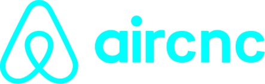

<h1 align="center" style="background-color:black;">
    
</h1>

<h4 align="center"> 
	🚀 Desafio Hiring Coders
</h4>

  

  
	
  

  

  
<a aria-label="Completed" href="https://gama.academy/">
    </img>
  </a>
  

  <a href="#-project">Projeto</a>&nbsp;&nbsp;&nbsp;|&nbsp;&nbsp;&nbsp;
  <a href="#rocket-Technologies">Tecnologias</a>&nbsp;&nbsp;&nbsp;|&nbsp;&nbsp;&nbsp;
  <a href="#-how-to-contribute">Como contribuir</a>&nbsp;&nbsp;&nbsp;|&nbsp;&nbsp;&nbsp;
  <a href="#memo-license">Licença</a>

## 💻 Projeto

Aircnc é um site clone do Airbnb onde ele consome uma api para renderizar cards com imóveis para hospedagem. Foi desenvolvido apenas para fins didáticos.

<h1 align="center">
    
</h1>

## 🚀 Tecnologias

This project was developed with the following technologies:

- [HTML](https://developer.mozilla.org/pt-BR/docs/Web/HTML/) 
- [CSS](https://developer.mozilla.org/pt-BR/docs/Web/CSS)
- [Javascript](https://developer.mozilla.org/pt-BR/docs/Web/Javascriptz)

## 🤔 Como contribuir?
Você pode também ser um contribuidor nesse projeto sugerindo features e bugfix's. Abra uma issue.

- Faça um fork;
- Crie uma branch com sua feature: `git checkout -b my-feature`;
- Faça o commit das mudanças: `git commit -m 'feat: minha nova feature'`;
- Faça o push para sua branch: `git push origin my-feature`;

Depois que seu pull request for mesclada com a `master` você pode excluir a branch criada anteriormente.

## :memo: Licença
Esse projeto está sob a licença MIT. Veja [LICENSE](LICENSE.md) para mais detalhes

---

Made with ♥ by Lougans de Matos :wave: [Get in touch!](https://www.linkedin.com/in/lougansdematos/)
